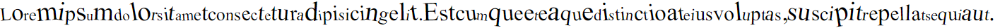

# RanSize.js
#### A wacky library for some wacky coders 

## RanSize.js - What is this?
This is a library is assigns random font-size to each letter in the given block that contains text in it

## RanSize.js - How to use this?
- You can download directly from this repository 
- Or else you can you these CDN

    - Normal Version   : https://cdn.jsdelivr.net/gh/DhanushAdithya/RanSize.js/lib/ransize.js
    - Minified Version : https://cdn.jsdelivr.net/gh/DhanushAdithya/RanSize.js/lib/ransize.min.js

## RanSize.js - Examples
Here are few examples of this library
```js
var random = new RanSize('random').apply();
```

```js
var random = new RanSize('random',
{
    colors: true
}).apply();
```

```js
var random = new RanSize('random',
{
    min: 0.5
}).apply();
```

```js
var random = new RanSize('random',
{
    max: 3
}).apply();
```

```js
var random = new RanSize('random',
{
    pattern: true,
    value: [2, 1.7, 1.3, 1, 1.3, 1.7]
}).apply();
```

```js
var random = new RanSize('random',
{
    pattern: true,
    value: [2, 1.7, 1.3, 1, 1.3, 1.7],
    class: 'random'
}).apply();
```
```css
#random {
    display: flex;
    justify-content: baseline;
}
.random {
    letter-spacing: 5px;
}
```

```js
var random = new RanSize('random', {
    rotate: true
}).apply();
```


You can use everything in a single object too <br>Or you can create an object seperately and specify it as the arguement

## RanSize.js - Demo

Click here for [Demo](https://dhanushadithya.github.io/RanSize.js/demo/)


## Thanks,
[](https://github.com/NoxFly)
[](https://github.com/Dob6458)
