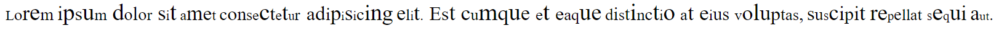
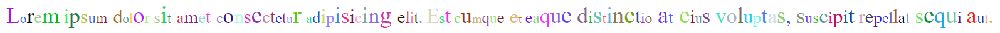
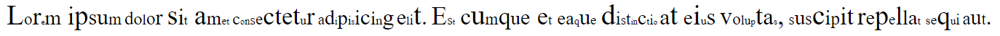
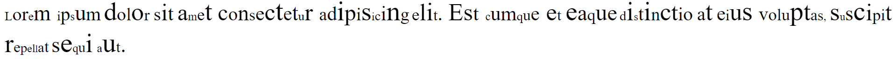
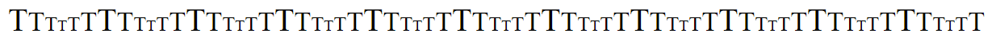
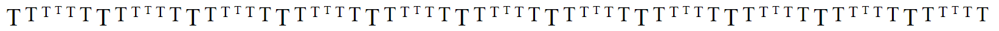

# RanSize.js
### A wacky library for some wacky coders 

## RanSize.js - What is this?
#### This is a library is assigns random font-size to each letter in the given block that contains text in it

## RanSize.js - How to use this?
- You can download directly from this repository 

## RanSize.js - Examples
#### Here are few examples of this library
```js
var random = new RanSize('random')
random.apply()
```

```js
var random = new Ransize('random',
{
    colors: true
})
random.apply()
```

```js
var random = new Ransize('random',
{
    min: 0.5
})
random.apply()
```

```js
var random = new Ransize('random',
{
    max: 3
})
random.apply()
```

```js
var random = new Ransize('random',
{
    pattern: true,
    values: [2, 1.7, 1.3, 1, 1.3, 1.7]
})
random.apply()
```

```css
#random {
    display: flex;
    justify-content: baseline;
}
.random {
    letter-spacing: 5px;
}
```
```js
var random = new Ransize('random',
{
    pattern: true,
    values: [2, 1.7, 1.3, 1, 1.3, 1.7],
    class: 'random'
})
random.apply()
```


#### You can use everthing in a single object too<br>Or you can create an object seperately and specify it as the arguement

## Thanks,
[](https://github.com/NoxFly)
[](https://github.com/Dob6458)